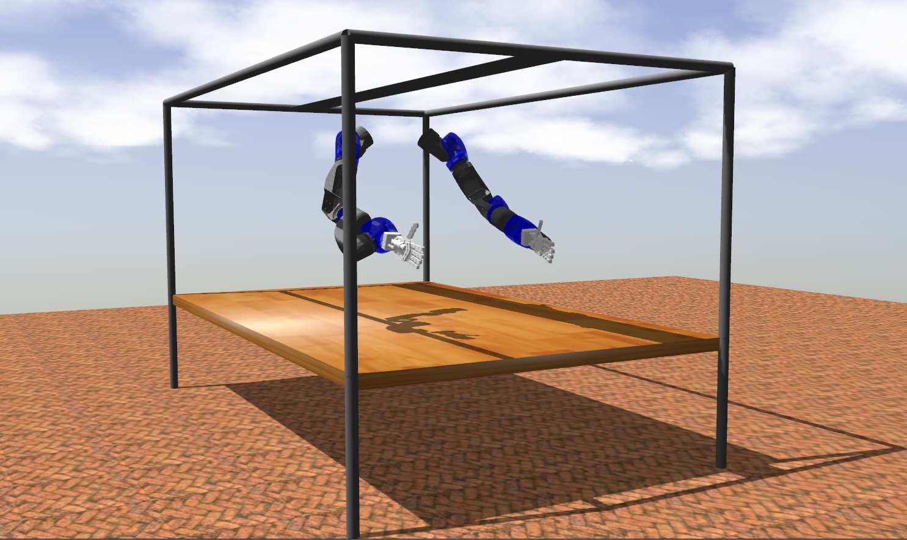

# iit-repair-ros-pkg




### Depends on:
- catkin
- xacro
- [Xbot2](https://advrhumanoids.github.io/xbot2/quickstart.html)
- [Softhand-plugin](https://github.com/ADVRHumanoids/SoftHand-Plugin/tree/repair)

### To visualize RePair on RViz and play with its joints:

``` roslaunch repair_urdf repair_full_slider.launch ```

### To launch RePair on RViz without the joint_state_publisher_gui:

``` roslaunch repair_urdf repair_full.launch ```

### To use the simulator:

- open a terminal, launch Gazebo simulation with ``` roslaunch repair_gazebo repair_gazebo.launch ```

- open a terminal and set the xbot2 config file with ``` set_xbot2_config {path2iit-repair-ros-pkg}/repair_cntrl/config/repair_basic.yaml```

- in the same terminal run ``` xbot2-core -S ```

- open a terminal and run ``` xbot2-gui ```, which will open an interactive gui to play with the platform's joints and hands. Enable the plugin "ros_control", go to the "chain selection" column, select the chain, click "enable" and send commands to joints using sliders. For the Softhand, click on the tab called "Softhand", select the chosen hand from the dropdown menu; you can either send the grasping command to the hand or open it with a dedicated tab.

- to inspect all the topics exposed by xbot2 run ``` rostopic list ```:
	
	- send commands to the joints (SoftHand excluded) using ```/xbotcore/command``` topic
	- read joint states (SoftHand excluded) using ```/xbotcore/joint_states``` topic
	- send commands to the SoftHans using ```/{left/right}_hand_v1s/synergy_command``` topic, or inspect the state of each finger looking at ```/{left/right}_hand_v1s/{fingername}_state``` topic

