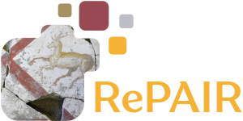

# RePAIR ROS Robot



# 1) Description
This repository contains the software to control the simulated and real RePAIR robot.

### Dependencies
- [catkin](https://catkin-tools.readthedocs.io/en/latest/verbs/catkin_build.html)
- [xacro](http://wiki.ros.org/xacro)
- [Xbot2](https://advrhumanoids.github.io/xbot2/master/index.html)
- [Softhand-plugin](https://github.com/vamsikalagaturu/SoftHand-Plugin/tree/synergy_joint)
- [roboticsgroup_upatras_gazebo_plugins](https://github.com/roboticsgroup/roboticsgroup_upatras_gazebo_plugins)
- [gazebo2rviz](https://github.com/andreasBihlmaier/gazebo2rviz)
- [pysdf](https://github.com/andreasBihlmaier/pysdf)
- [realsense] (https://github.com/issaiass/realsense2_description)
- moveit
- install ddynamical reconfigure
 ``` sudo apt-get install ros-noetic-ddynamic-reconfigure```
- realsense2_camera is available as a debian package of ROS distribution. It can be installed by typing:
```sudo apt-get install ros-$ROS_DISTRO-realsense2-camera```
- [realsense_gazebo_plugin](https://github.com/issaiass/realsense_gazebo_plugin/tree/master)

# 2) Installation
## 🛠 General Installation

1. First, clone the repository and its submodules:

	```bash
	mkdir -p ~/repair_robot_ws/src && cd ~/repair_robot_ws/src

	git clone --recurse-submodules -j8 https://github.com/RePAIRProject/repair_ros_robot.git
	git clone https://github.com/RePAIRProject/repair_motion_controller
	```
2. Download fresco 3D models from [Nextcloud](https://cloud.vi.cs.uni-bonn.de/index.php/s/MsAF7bEkNmRZ2jB) to `src/repair_ros_robot/repair_urdf/sdf`. As of now some Frescos might need their own urdf which should just be copy paste of names. 
3. Download fresco recognition models and placing sequence from [Nextcloud](https://cloud.vi.cs.uni-bonn.de/index.php/s/5AW56qWi5EbY4g8) to `src/repair_ros_robot/repair_interface/sand_detection_models`.


## 🐳 Docker Setup (VS Code)
We provide Docker-based installation instructions compatible with [Visual Studio Code's Dev Containers](https://code.visualstudio.com/docs/devcontainers/containers). However, these steps mostly also apply to standard Docker usage.
<details>
 
> **Prerequisites:** Complete the general installation above before proceeding.

### 1. Enable Docker Display Access

In a terminal, run: ``` xhost +local:docker```

### 2. Install GPU Support

To enable visual outputs via GPU, install the following (if not already present):

```bash
sudo apt-get install -y nvidia-container-toolkit
sudo nvidia-ctk runtime configure --runtime=docker
sudo systemctl restart docker
```

### 3. Prepare the `.devcontainer` Folder
Our work is based on this [ROS1 Docker Container](https://github.com/Eruvae/ROS-devcontainer/tree/main/ros1). Either create a new `.devcontainer` folder or copy the one from the before mentioned ROS1 Docker setup into `~/repair_robot_ws`. Then, replace or add the following example files (provided in this repo) inside `.devcontainer`:

```
example_dockerfile.txt      → Dockerfile  
example_postcreate.sh       → postCreate.sh  
example_devcontainer.json   → devcontainer.json  
requirements.txt
```

### 4. Launch the Container in VS Code

1. Install the **Dev Containers** extension in VS Code.
2. Press `Ctrl + Shift + P` and select ``` Dev Containers: Open Folder in Container```
3. Choose the `~/repair_robot_ws` folder.
4. VS Code will now build the container. To rebuild it later, repeat the same command and select: ```Dev Containers: Rebuild Container```

### 5. Build the ROS Workspace

Once inside the container, build your workspace:

```bash
cd /home/ws
catkin build
```

### 6. Configure XBot2
> 🛠 The **XBot** installation is handled automatically by the `postCreate.sh` script. However, please add the following commands in order to: 1. source the ROS workspace and 2. source XBot2 in the .bashrc to be able to run ROS and XBot2 commands later in every terminal.
```bash
echo "source /home/ws/devel/setup.bash" >> ~/.bashrc
echo ". /opt/xbot/setup.sh" >> ~/.bashrc
source ~/.bashrc
```

To set the XBot2 configuration use:
```bash
set_xbot2_config /home/ws/src/repair_ros_robot/repair_cntrl/config/repair_basic.yaml
```


#### 💥 In case your memory gets filled up by VsCode when starting it leading to a PcCrash:
- Try to close the Ports in VsCode and or Rebuild your container without cache.

### ✅ Optional: Restore Terminal Colors in Docker

If your Docker terminal lacks color, fix it by adding the following to `/root/.bashrc`:

```bash
sudo nano /root/.bashrc
# Add the following line
export PS1="\[\e[1;32m\]\u@\h:\[\e[1;34m\]\w\[\e[0m\]\$ "
```
</details>

## 🖥️ Local Installation (Without Docker)

If you prefer to run the project natively without Docker, follow these steps **after** completing the [General Installation](#-general-installation).

<details>
### 1. Install Python Dependencies

```bash
cd ~/repair_robot_ws/src/repair_ros_robot
pip3 install -r requirements.txt
```

### 2. Build the ROS Workspace

Ensure you have sourced your ROS environment in every terminal:

```bash
source /opt/ros/noetic/setup.bash
cd ~/repair_robot_ws
catkin build
```

---

### ⚠️ Troubleshooting Build Errors

If you encounter errors like:

```bash
CMake Error at /opt/ros/noetic/share/catkin/cmake/catkinConfig.cmake:83 (find_package):
Could not find a package configuration file provided by "package_name" ...
```

Check the solutions below:

#### 🔧 Missing: `ddynamic_reconfigure` (used by `realsense2`)

```bash
sudo apt-get install ros-noetic-ddynamic-reconfigure
```

#### 🔧 Missing: `moveit_ros_planning` (used by `repair_moveit_xbot`)

```bash
sudo apt-get install ros-noetic-moveit
```

#### 🔧 Missing: `rviz_visual_tools` (used by `repair_moveit_xbot`)

```bash
sudo apt-get install ros-noetic-rviz-visual-tools
```

#### 🔧 Missing: `moveit_visual_tools` (used by `repair_moveit_xbot`)

```bash
sudo apt-get install ros-noetic-moveit-visual-tools
```

---

### 3. Source the Workspace

After a successful build:

```bash
cd ~/repair_robot_ws
source devel/setup.bash
```

### 4. Install XBot2 (Real Robot Driver Support)

Follow the [official XBot2 installation guide](https://advrhumanoids.github.io/xbot2/master/index.html), or run:

```bash
# ROS setup
sudo sh -c 'echo "deb http://packages.ros.org/ros/ubuntu $(lsb_release -sc) main" > /etc/apt/sources.list.d/ros-latest.list'
sudo apt install curl 
curl -s https://raw.githubusercontent.com/ros/rosdistro/master/ros.asc | sudo apt-key add -
sudo apt update && sudo apt install -y ros-noetic-ros-base libgazebo11-dev

echo ". /opt/ros/noetic/setup.bash" >> ~/.bashrc
source ~/.bashrc

# Additional ROS and GUI tools
sudo apt install -y \
ros-$ROS_DISTRO-urdf ros-$ROS_DISTRO-kdl-parser \
ros-$ROS_DISTRO-eigen-conversions ros-$ROS_DISTRO-robot-state-publisher ros-$ROS_DISTRO-moveit-core \
ros-$ROS_DISTRO-rviz ros-$ROS_DISTRO-interactive-markers ros-$ROS_DISTRO-tf-conversions ros-$ROS_DISTRO-tf2-eigen \
qttools5-dev libqt5charts5-dev qtdeclarative5-dev

# XBot2 repository setup
sudo sh -c 'echo "deb http://xbot.cloud/xbot2/ubuntu/$(lsb_release -sc) /" > /etc/apt/sources.list.d/xbot-latest.list'
wget -q -O - http://xbot.cloud/xbot2/ubuntu/KEY.gpg | sudo apt-key add -
sudo apt update
sudo apt install xbot2_desktop_full

echo ". /opt/xbot/setup.sh" >> ~/.bashrc
```

### 5. Configure XBot2

To set the XBot2 configuration:

```bash
set_xbot2_config ~/repair_robot_ws/src/repair_ros_robot/repair_cntrl/config/repair_basic.yaml
```

 More Information
For additional details on the interface, refer to the [repair_interface documentation](https://github.com/RePAIRProject/repair_ros_robot/tree/main/repair_interface).
---
</details>


# 3.) Usage Guide

## Simple Gazebo Simulation

### 🔍 Inspect the Robot in Gazebo

```bash
roslaunch repair_gazebo repair_gazebo.launch
```

### ⚠️ Known Warnings
- You can safely ignore the following error messages — they pertain to position controllers and missing `p` gains, which are only relevant for effort controllers:
	```
	[ERROR] No p gain specified for pid. Namespace: /gazebo_ros_control/pid_gains/x_joint
	```
- URDF warnings like:
  ```
  [ WARN] Link 'right_hand_v1_2_research_thumb_proximal_link' is not known to URDF.
  ```
  These do not impact functionality. You may not see hand animations in RViz but simulations work fine.

---

## Gazebo with XBot2
To run the overall fresco manipulation pipeline as devoloped on the real robot, simply follow the following steps.

<details>
### Controller Based Commands: 1 Terminal, 4 Splits

Run each command in its own split:

```bash
roscore
xbot2-core --hw dummy
roslaunch repair_motion_controller bringup_motion_controller.launch
xbot2-gui
```
⚠️ after launching `xbot2-gui` start `homing` and `ros_control`! the simulation will not run properly otherwise.  
> 🔧 Set the `motion_controller_launch` to use `"dummy"` instead of `"real"`.

---

### Run Simulation Commands:
To run the simulation we offer two options, where option 1. is the prefered one:
1. Single combined launch:

	```bash
	roslaunch repair_gazebo repair_gazebo_gazebo.launch
	```

2. Manual launch of each component:

	```bash
	roslaunch repair_gazebo repair_gazebo.launch
	roslaunch repair_gazebo control_utils.launch
	/bin/python /home/ws/src/repair_ros_robot/repair_gazebo/src/xbot_to_gazebo.py
	/bin/python /home/ws/src/repair_ros_robot/repair_gazebo/src/republisher_xbot_to_hand.py
	```
⚠️  After Launching Gazebo, make sure to enable the play button ▶️ inside Gazebo to run the simulation

### Run Pipeline Commands:
### Load Frescos
To spawn a Fresco piece inside the Gazebo simulation, run:
```bash
/home/ws/src/repair_ros_robot/repair_interface/scripts/launch_fresco.py
```
Everytime this command is repeated, the fresco will be respawned at the same position

### Run Experiments 
To run the experiment run the following commands in two seperate terminals:

Terminal 1:

```bash
/bin/python /home/ws/src/repair_ros_robot/repair_interface/scripts/sand_recognition.py --use_gazebo
```

Terminal 2:

```bash
/bin/python /home/ws/src/repair_ros_robot/repair_interface/scripts/moveit_multi_fresco.py --use_gazebo
```
> Offset values and other parameters for the pipeline are specified in `repair_interface/scripts/configs/gazebo_pipeline_config.yaml`

> 🔭 One can turn on/off the gazing of the inactive Hand towards the active Hand in the repair_motion_control_server.py 

---

### ✋ Run Arm Movement Only (No Grasping)

You can disable link attachment logic by removing the functions `attach_links` and `detach_links` in `moveit_multi_fresco_cleaned_gazebo.py`.  
You can hardcode the result of grasping to `True` to bypass grasp simulation.

Use the following code for arm motion:

```python
publish_tf_np(arm_target_pose_np, child_frame='arm_grasp_pose')
self.move_arm(self.arm, arm_target_pose_np)
```

Reset robot to home pose:

```python
self.go_home_pose()
```
---
</details>


# 🤖 Real-World Robot Usage Guide

Controlling the real robot requires **XBot2**. A **dummy mode** is also available to emulate the real robot interface — ideal for testing MoveIt and RViz without `ros_control`.  

<details>

## 🦾 Real Robot Setup

### 1. Configure `.bashrc`

Set your environment to connect to the robot’s ROS master. Add this to your `.bashrc`:

```bash
export ROS_MASTER_URI=http://{robot_IP}:11311
export ROS_IP={local_IP}
```

Then, source your `.bashrc`:

```bash
source ~/.bashrc
```

---

### 2. Remote Setup on Robot PC (via SSH)

```bash
ssh -X {username}@{robot_IP}
```

#### Terminal 1 – Check/Start roscore
```bash
rostopic list
# If not running:
systemctl --user restart roscore.service
```

#### Terminal 1 – Start EtherCAT Master
```bash
ecat_master
```

#### Terminal 2 – Start XBot2 with Position Control
```bash
xbot2-core --hw ec_pos
# Or for idle mode:
# xbot2-core --hw idle
```

#### Terminal 3 – Start GUI
```bash
xbot2-gui
```

---

### 3. Local PC Setup (3 Terminals)

#### Terminal 1 – Start Motion Controller (MoveIt + Klampt)
```bash
roslaunch repair_motion_controller bringup_motion_controller.launch
```

#### Terminal 2 – Only MoveIt
```bash
roslaunch repair_moveit_xbot bringup_moveit.launch
rosrun repair_interface moveit_client.py
```

#### Terminal 3 – Start Chest-mounted Camera
```bash
roslaunch realsense2_camera demo_pointcloud_new.launch serial_no:=f1061874
```

---

### 4. Fresco Recognition

Download Fresco recognition models and run:

```bash
rosrun sand_recognition.py
```

**Available Models:**

```bash
model_name:="best_3pieces_15epochs_larger_batch.pt"  # Group 89 (robust, 3 classes)
model_name:="best_mix.pt"                            # Group 15 and 29
```

> **Note:**  
> - `best_3pieces_15epochs_larger_batch.pt` is robust but supports only 3 IDs.  
> - `best_g89_15epochs_larger_batch.pt` detects more IDs but may be less reliable. Consider reducing the `conf_debug` threshold (line 299) to increase fragment detection.

---

## 🧩 Pick and Place Demo

Run the multi-fragment pick & place pipeline:

```bash
rosrun repair_interface moveit_multi_fresco.py
```
>Offset values and other parameters for the pipeline are specified in `repair_interface/scripts/configs/real_pipeline_config.yaml`

**Note:**  
Use `sh_version` options: `v1_2_research`, `v1_wide`, `mixed_hands`.

---

## 📦 Required Files for Recognition

Ask **Luca Palmieri** for the following resources:

- Frescos `RPf_00123` to `RPf_001266` should be placed in:
  - `repair_ros_robot/repair_urdf/sdf`
  - `/home/.gazebo/models`
- Fragment database directory `fragments_db` should be added to:
  - `/home/.gazebo/`

---
</details>

# 📡 Important ROS Topics

- List all topics:
  ```bash
  rostopic list
  ```

- Send joint commands (excluding SoftHand):
  ```
  /xbotcore/command
  ```

- Read joint states (excluding SoftHand):
  ```
  /xbotcore/joint_states
  ```

- SoftHand commands:
  ```
  /left_hand_v1s/synergy_command
  /right_hand_v1s/synergy_command
  ```

- Finger states:
  ```
  /left_hand_v1s/{fingername}_state
  /right_hand_v1s/{fingername}_state
  ```

## LEGACY MoveIt Configuration
<details>
### ➕ Increase Path Resolution
In `repair_moveit_config_v2/config/ompl_planning.yaml`:

```yaml
longest_valid_segment_fraction: 0.00005
```

### 🐢 Adjust Arm Speeds
In `repair_moveit_config_v2/config/joint_limits.yaml`:

```yaml
default_velocity_scaling_factor: 0.1
default_acceleration_scaling_factor: 0.1
```

Alternatively, use the **Motion Planning** tab in RViz.
</details>

# 4) Known Issues
- 

# 5) Relevant publications
T.B.A.

